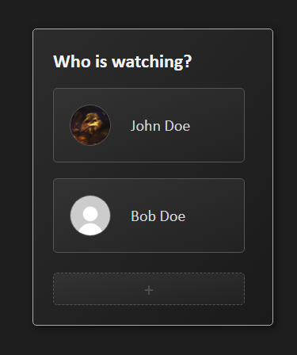
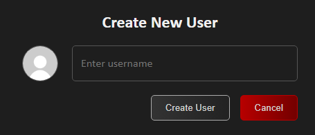
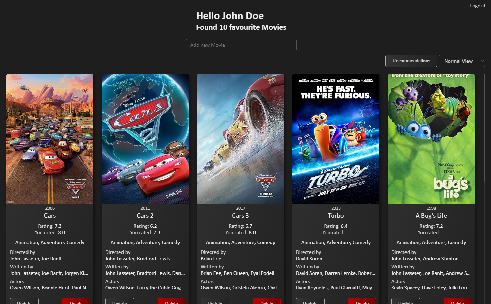
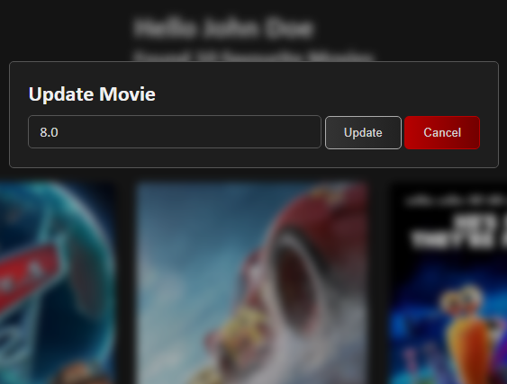
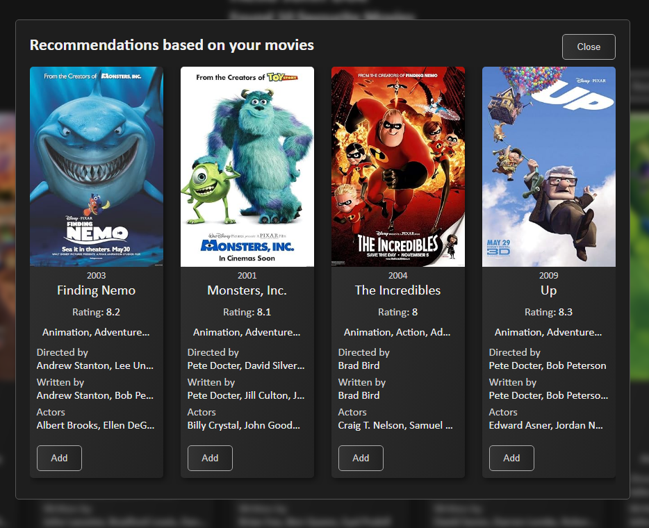
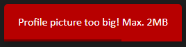
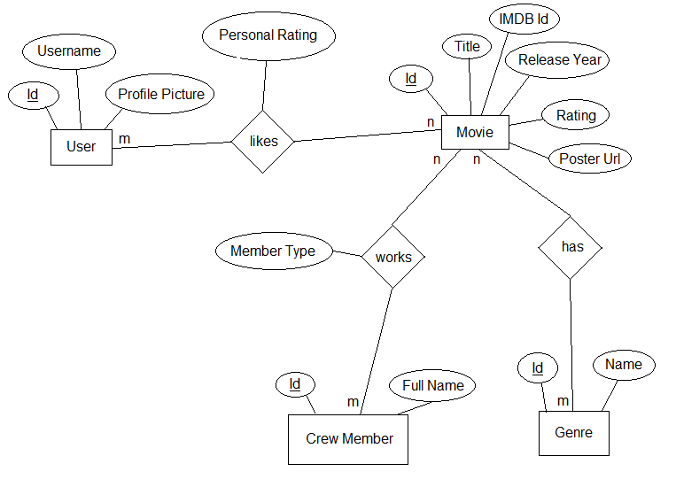

# Movie Library

Multi phase project of a program to manage a library of movies.\
Starting as a simple cli application and becoming a fully-featured web application.

---

## Phase 1

At this stage the project is just a simple CLI application.

### Functionality

- **CRUD**: Create, Read, Update, and Delete operations
- **Analytics**: Top-rated movies, least-rated movies etc.
- **Persistent Storage**: The data is loaded and stored in a JSON file

---

## Phase 2

At this stage the projects main user interface is still via the command line.\
But with the added functionality to generate a simple webpage containing the movies.

### Functionality

- **Including all functionality from Phase 1**
- **Refactoring the main components with an object oriented approach**
- **Extended Perstistent Storage**: You can choose between JSON & CSV now
- **API Fetching**: Information about the movies is fetched from an API
- **Website Generation**: A website can be generated showing all movies including posters

---

## Phase 3

At this stage the projects transforms from a static movie application into a full-featured, dynamic
web application.

### Functionality

- **Including core functionality from Phase 1 & 2**
- **CLI to the Web**: Web-accessible with HTML templating using Flask
- **ORM Database support**: From JSON to SQLite for data management
- **Multi User support**
- **RESTful API for the service**: Coming soon
- **AI features**: Coming soon
- **Login via Google**: Coming soon

---

## Final App

Going over all features from the final app version of phase 3, including pictures.

### Starting Page

- List of users
- Select one to use the app with (see/add/update/delete favourite movies, get recommendations)
- Add new user



### Adding user

- Username mandatory
- Optional upload profile picture
    - Profile pictures stored in the static/uploads directory (can be configured)
    - Allowed file types are PNG, JPG/JPEG, and GIF (can be configured)
    - Allowed file size is 2MB (can be configured)
    - Profile picture files saved with UUID filename
    - User entity has field referencing profile picture filename



### Favourite Movies

- Lists favourite movies of a user
- Search and add movies in search bar on top
- View modes: Compact, Normal, Wide to display more or less movie details
- Get recommendations
- Delete and update movies
- Click on movie poster opens IMDb page
- Logout to go back to homepage



### Search Movies

- Searches in DB and on OMDb
    - DB results are listed first, followed by OMDb results
    - Filters for duplicated results from both DB & OMDb
- Click on search result adds movie to favourites
    - If movie not yet in DB, it will be created
    - If movie already in DB, it wont get created again


### Update Movie

- Opens modal dialog
- Add or Update personal rating of a movie



### Delete Movie

- Delete a movie from the favourites of a user
- Movie wont be deleted from DB, only the association with the user

### Recommendations

- Opens modal dialog
- Using Gemini's 2.0 Flash model to get recommendations based on users favourite list
- Wont recommend movies already in favourites
- Available if 3+ movies in favourites (can be configured)



### Messages

- Display success and error messages in the top right corner
- Hide message after progress animation ends (duration can be configured in CSS)




## App configuration

Custom Flask-App configuration parameters and default values (from app/config.py):

````python
UPLOADS_FOLDER = "static/uploads"                   # Where profile pictures are stored
ALLOWED_FILE_TYPES = ("png", "jpg", "jpeg", "gif")  # Allowed file types for profile pictures
MAX_FILE_SIZE = 2 * 1024 * 1024                     # Max. allowed file size for profile pictures
START_RECOMMENDATIONS = 3                           # Min. movies in favourites to provide recommendations
````

## Entity-Relationship-Diagram

